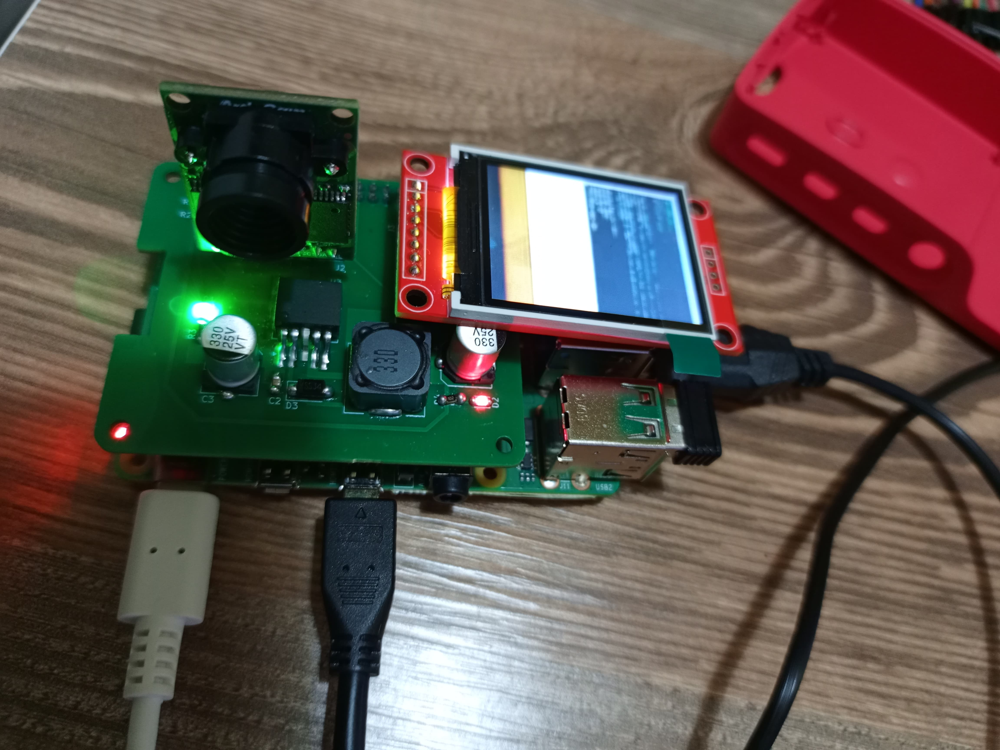
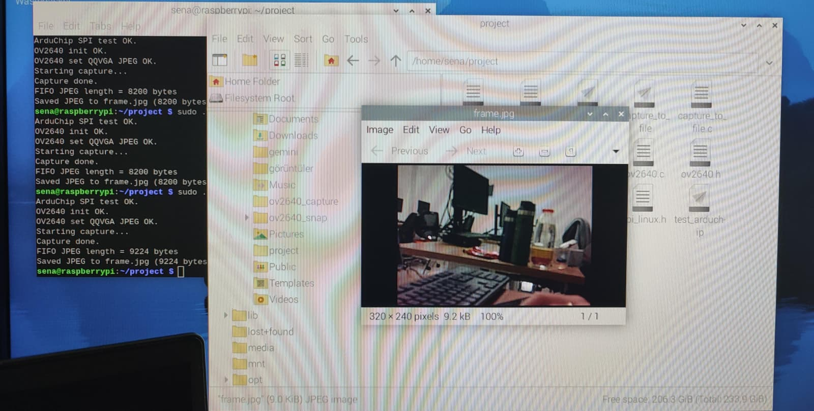
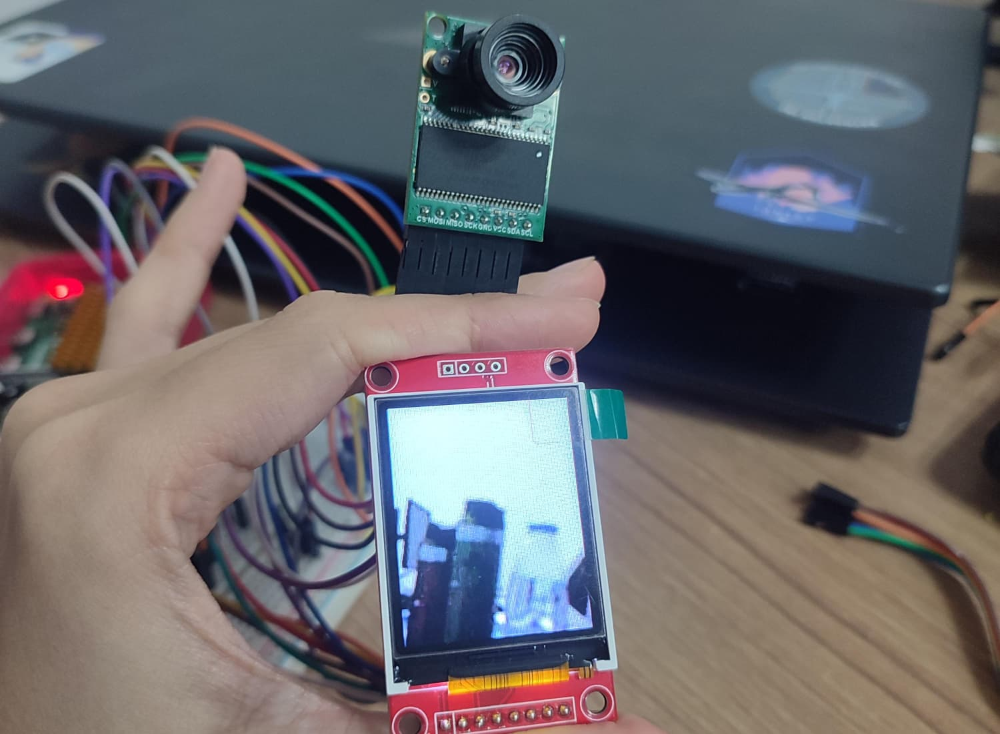

# Raspberry Pi Image Processing HAT

A custom **Raspberry Pi 4 Model B HAT** designed for image capture, processing, and display using an **ArduCAM OV2640 camera**, **ST7735 TFT display**, and an **LM2596S-3.3 based switching power supply**.

<p align="center">
  
</p>

## Project Overview

This project focuses on the design and implementation of a custom Hardware Attached on Top (**HAT**) board for the Raspberry Pi 4 Model B.

The system captures images using an **ArduCAM OV2640 camera**, processes the image data on the Raspberry Pi, and displays the resulting output on an **ST7735 TFT display**.

A custom PCB was designed to integrate the camera, display, Raspberry Pi GPIO interface, and power management circuitry into a compact embedded vision platform.

The main hardware blocks are:

- **Processing Unit:** Raspberry Pi 4 Model B
- **Image Capture:** ArduCAM Mini OV2640
- **Display:** ST7735 TFT
- **Power Management:** LM2596S-3.3 based SMPS
- **Custom Hardware:** Raspberry Pi HAT PCB

---

## System Architecture

The Raspberry Pi acts as the main processing and control unit.

The **ArduCAM OV2640** communicates with the Raspberry Pi using:

- **I²C** for camera sensor configuration
- **SPI** for image data transfer

The **ST7735 TFT display** uses:

- **SPI** for command and pixel data transfer
- GPIO signals for display control and reset

The overall image processing flow is:

```text
        ArduCAM OV2640
              │
       ┌──────┴──────┐
       │             │
      I²C           SPI
Configuration    Image Data
       │             │
       └──────┬──────┘
              ▼
       Raspberry Pi 4
              │
       JPEG Acquisition
              │
       Buffer Processing
              │
        JPEG Decoding
              │
       RGB565 Conversion
              │
              ▼
       ST7735 TFT Display
```

---

## Hardware Design

The custom HAT PCB was designed using **KiCad EDA**.

The hardware design includes:

- Raspberry Pi 40-pin GPIO interface
- ArduCAM OV2640 camera connector
- ST7735 TFT display connector
- LM2596S-3.3 switching regulator
- SPI communication lines
- I²C communication lines
- Dedicated chip-select signals
- Power distribution circuitry
- Ground plane for improved signal integrity
- SMD and THT components

The PCB was designed as a **two-layer board** and manufactured using the generated Gerber files.

After production, the components were assembled and the board was mounted directly onto the Raspberry Pi for functional testing.

---

## Power Management

An **LM2596S-3.3 based switching power supply (SMPS)** was integrated into the HAT design.

The power stage converts the available supply voltage to the required **3.3 V rail** for the peripheral hardware.

A switching regulator was preferred to provide:

- Higher energy efficiency
- Reduced thermal losses
- Stable output voltage
- Better performance under varying current loads
- Improved suitability for embedded applications

---

## Software Architecture

The software was developed using **C and C++** on Raspberry Pi OS.

The implementation includes:

- ArduChip communication
- OV2640 sensor initialization
- I²C communication
- SPI communication
- JPEG image acquisition
- JPEG file storage
- JPEG decoding
- RGB565 image conversion
- ST7735 TFT display control
- Camera and display integration
- Hardware test programs

### Main Source Files

```text
arduchip.c
arduchip.h

ov2640.c
ov2640.h
ov2640_regs.c
ov2640_regs.h

spi_linux.c
spi_linux.h

i2c_linux.c
i2c_linux.h

jpeg_to_rgb565.c
jpeg_to_rgb565.h

capture_to_file.c
capture_to_screen.cpp
decode_test.c

test_arduchip.c
test_hal.c
```

---

## Build System

The project includes a **Makefile** for compiling and running the camera, image processing, and TFT applications.

### Compilers

The project uses:

```text
gcc
g++
```

The full camera-to-display application is compiled using:

```text
-std=gnu++20
```

### Libraries

The TFT application uses:

```text
rpidisplaygl
lgpio
librt
```

with:

```text
/usr/local/include
/usr/local/lib
```

---

## Build & Run

### Show Available Commands

```bash
make
```

The default target displays the available build and run commands.

### Clean Build Files

```bash
make clean
```

This removes generated object files, executables, and temporary image files such as:

```text
frame.jpg
frame.rgb565
```

---

### ArduChip SPI Test

Compile:

```bash
make test_arduchip
```

Run:

```bash
make run_test_arduchip
```

This test verifies communication with the ArduChip interface.

---

### OV2640 Initialization Test

Compile:

```bash
make test_hal
```

Run:

```bash
make run_test_hal
```

This test verifies OV2640 initialization and communication through the hardware abstraction layer.

---

### Capture JPEG Image

Compile:

```bash
make capture_app
```

Run:

```bash
make run_capture_app
```

The application captures an image from the OV2640 camera and stores the acquired JPEG data.

---

### JPEG to RGB565 Conversion

Compile:

```bash
make decode_test
```

Run:

```bash
make run_decode_test
```

This application tests the conversion of captured JPEG image data into the **RGB565** pixel format used by the TFT display.

---

### Full Camera-to-TFT Pipeline

Compile:

```bash
make capture_screen
```

Run:

```bash
make run_capture_screen
```

This application combines the complete image pipeline:

```text
Camera
  ↓
JPEG Capture
  ↓
Image Processing
  ↓
RGB565 Conversion
  ↓
ST7735 TFT
```

---

# Project Gallery

## Final Integrated HAT System

The final implementation combines the custom HAT PCB, **ArduCAM OV2640 camera**, **ST7735 TFT display**, onboard power stage, and Raspberry Pi into a single integrated system.

<p align="center">
  
</p>

---

## Camera Capture Test

The OV2640 camera was configured and tested on the Raspberry Pi.

Image data captured from the camera was transferred to the Raspberry Pi and successfully stored as a JPEG image.

<p align="center">
  
</p>

The terminal output verifies the camera communication and image acquisition process, including:

```text
ArduChip SPI test OK
OV2640 init OK
Starting capture...
Capture done
Saved JPEG to frame.jpg
```

---

## Camera-to-TFT Integration Test

The image captured by the OV2640 camera was processed by the Raspberry Pi and displayed on the ST7735 TFT.

<p align="center">
  
</p>

This test demonstrates the complete image pipeline from **camera acquisition to TFT visualization**.

---

## Testing

The system was tested incrementally before full integration.

The main test stages included:

- ArduChip SPI communication test
- OV2640 initialization test
- I²C sensor configuration
- SPI image data transfer
- JPEG image capture
- JPEG file storage
- JPEG decoding
- RGB565 conversion
- ST7735 graphical tests
- PCB electrical tests
- Camera and display integration
- Full system functional test

The final system successfully captured image data from the OV2640 camera, processed the image on the Raspberry Pi, and displayed the resulting image on the ST7735 TFT.

---

## PCB Development

The PCB development process consisted of:

```text
System Requirements
        ↓
Component Selection
        ↓
Schematic Design
        ↓
PCB Layout
        ↓
Gerber Generation
        ↓
PCB Manufacturing
        ↓
Component Assembly
        ↓
Electrical Testing
        ↓
Raspberry Pi Integration
        ↓
Functional Testing
```

The PCB design files and manufacturing outputs are included in the repository.

---

## Technologies & Tools

### Hardware

- Raspberry Pi 4 Model B
- ArduCAM OV2640
- ST7735 TFT
- LM2596S-3.3
- Custom Raspberry Pi HAT PCB

### Communication

- SPI
- I²C
- GPIO

### Software

- C
- C++
- GNU Make
- Raspberry Pi OS

### PCB Design

- KiCad EDA
- Gerber
- Two-layer PCB design

---

## Repository Contents

The repository contains:

```text
Raspberry-Pi-Image-Processing-HAT/
│
├── images/
│   ├── final_hat_system.jpg
│   ├── camera_capture_test.jpeg
│   └── camera_tft_test.jpeg
│
├── KiCad/
│   └── PCB and schematic design files
│
├── mühtas_1_project/
│   ├── Camera drivers
│   ├── SPI / I²C drivers
│   ├── Image processing files
│   ├── TFT application
│   └── Makefile
│
├── rapor/
│   └── Project documentation and reports
│
└── README.md
```

---

## Documentation

Detailed project documentation, design reports, system requirements, and test procedures are available in the repository.

The project documentation covers:

- System architecture
- Hardware design
- Power management
- Camera communication
- TFT communication
- PCB design
- Manufacturing
- Software development
- Integration
- Functional testing

---

## Project Context

This project was developed as part of the **MÜHTAS-1 Engineering Design Project** in the **Department of Electronics and Communication Engineering at Kocaeli University**.

The project combines embedded software development, digital communication interfaces, PCB design, power electronics, and image processing into a complete embedded vision system.

---

## Author

**Sena Sümeyye Durarslan**

Electronics and Communication Engineering  
Kocaeli University
